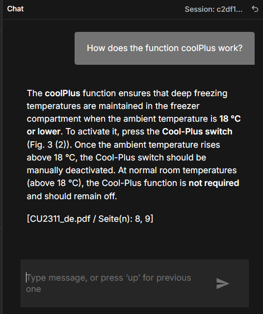
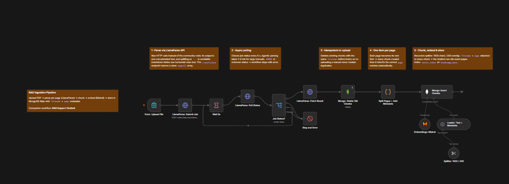
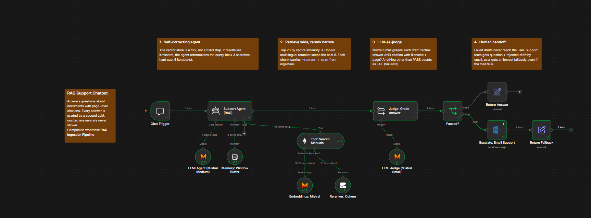

# RAG Chatbot with Page-Level Citations (n8n)

A document Q&A chatbot that answers questions from your PDFs and **cites the exact file and page** for every answer.
Answers without a verifiable source are never shown to the user. They are escalated to a human instead.

Built with **n8n**, **LlamaParse**, **MongoDB Atlas Vector Search**, **Mistral** and **Cohere**.



---

## Use cases

The system works with any collection of PDFs. It performs best where answers must be traceable:

- **Customer & technical support** (primary use case): answer questions from product manuals and point users to the exact page
- **University & learning**: ask questions about lecture slides and scripts, get the slide/page to review
- **Internal knowledge bases**: policies, handbooks, process documentation

Only the system prompt needs to be adapted to the domain. The included configuration is set up for a support scenario.

---

## How it works

The project consists of two workflows sharing one MongoDB collection:

| Workflow | Purpose | Details |
|---|---|---|
| **01 · Ingestion** | Upload PDF → parse per page → chunk → embed → store with `filename` + `page` | [docs/ingestion.md](docs/ingestion.md) |
| **02 · Chatbot** | Self-correcting agent → rerank → LLM judge → answer or escalate | [docs/chatbot.md](docs/chatbot.md) |

```
INGESTION
Form upload → LlamaParse (async, per page) → split pages → chunk 1500/200
→ Mistral embeddings → MongoDB Atlas  { text, embedding, filename, page }

CHATBOT
Chat → Agent ⇄ Vector search (top 20) → Cohere rerank (top 5)
     → LLM judge ── PASS → answer with [file / page]
                 └─ FAIL → email to support + honest fallback message
```




---

## Key features

- **Page-level citations.** Every chunk carries its source page. Answers end with e.g. `[Manual.pdf / Seite(n): 7, 12]`.
- **Self-correcting retrieval.** The agent judges its own search results and reformulates the query up to 3 times.
- **Retrieve wide, rerank narrow.** 20 candidates by vector similarity, a multilingual reranker keeps the best 5. Less noise, lower token cost.
- **LLM-as-judge quality gate.** A second model checks every draft for a factual answer and a valid citation. Anything but PASS is treated as FAIL.
- **Human handoff.** Failed answers trigger a support email with the question and rejected draft. The user always gets a response.
- **Idempotent ingestion.** Re-uploading a file replaces its old chunks instead of duplicating them.

---

## Tech stack

| Component | Choice | Why |
|---|---|---|
| Orchestration | n8n | Visual, self-hostable, native LangChain nodes |
| Parsing | LlamaParse (agentic) | Handles tables and layouts, returns per-page output |
| Embeddings | Mistral `mistral-embed` (1024 dim) | EU provider, good multilingual quality |
| Vector DB | MongoDB Atlas Vector Search | Vectors + metadata in one document |
| Reranking | Cohere `rerank-multilingual-v3.0` | Strong on German content |
| Agent LLM | Mistral Medium | Reasoning for multi-step retrieval |
| Judge LLM | Mistral Small | Cheap binary classification |
| Escalation | Microsoft Outlook | Ticket email to humans |

---

## Setup

1. **Credentials in n8n:** LlamaParse, Mistral, Cohere, MongoDB, Microsoft Outlook
2. **MongoDB Atlas:** create collection `knowledge_base` and a vector search index `vector_index` using [docs/atlas-vector-index.json](docs/atlas-vector-index.json)
3. **Import workflows:** in n8n *Workflow → Import from File* → `workflows/01_ingestion.json` and `02_chatbot.json`, then assign your credentials to each node
4. **Chatbot:** set the escalation email address and adapt the system prompt to your domain
5. Keep the Chat Trigger's response mode on **"When Last Node Finishes"**. Streaming would bypass the judge.
6. Upload a PDF via the ingestion form, then start chatting

---

## Known limitations

- The judge checks that a citation *exists* and the answer is plausible, not that the cited page actually supports the claim.
- Chunks are split per page. Content spanning a page break ends up in two chunks.
- The ingestion polling loop has no max-retry limit for jobs stuck in `PENDING`.
- One additional LLM call per answer (judge) adds latency.

## Roadmap

- Grounding check against the cited chunk
- Metadata filter per document for multi-course / multi-product setups
- Logging PASS/FAIL rates to detect knowledge gaps

---

## License

MIT
